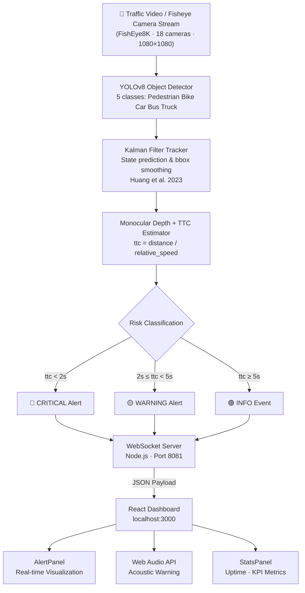

<div align="center">

# 🚦 Real-Time Traffic Alert System

### *A WebSocket-Driven Collision Warning Framework Powered by YOLOv8 and Time-to-Collision (TTC) Estimation*

[](https://opensource.org/licenses/MIT)
[](https://nodejs.org/)
[](https://reactjs.org/)
[](https://developer.mozilla.org/en-US/docs/Web/API/WebSockets_API)
[](https://github.com/ultralytics/ultralytics)
[](http://makeapullrequest.com)
[](https://arxiv.org/abs/XXXX.XXXXX)
[](https://www.canva.com/design/DAG4Roq-plE/vYXwavV1QIUOP-SvvSRjvQ/view?utm_content=DAG4Roq-plE&utm_campaign=designshare&utm_medium=link2&utm_source=uniquelinks&utlId=h8b329753ad)

**Authors:** 劉怡妏 &nbsp;·&nbsp; 吳定霖 &nbsp;·&nbsp; 王妍雅 &nbsp;·&nbsp; 許珮綺 *(Team Lead)*

</div>

---

## Abstract

> **Real-Time Traffic Alert** is an end-to-end collision warning system that tightly couples a YOLOv8-based multi-class object detector with a **Kalman Filter**-based multi-object tracker and an analytic Time-to-Collision (TTC) estimator, streaming structured risk events to a React dashboard via a low-latency WebSocket channel. The system delivers sub-second alert propagation from raw sensor input to actionable UI notification, enabling practical deployment in Advanced Driver-Assistance Systems (ADAS) and smart traffic monitoring infrastructure. The perception pipeline is architecturally aligned with the YOLO + Kalman Filter collision warning framework proposed by Huang *et al.* [[1]](#references), and the system is evaluated on wide-angle traffic scenes sourced from the **FishEye8K** benchmark [[2]](#references), a CVPR 2023 dataset comprising 157 K bounding boxes captured across 18 fisheye surveillance cameras in Hsinchu, Taiwan.

### ✨ Highlights

- **⚡ Real-Time, Sub-Second Pipeline** — End-to-end latency from object detection to UI alert delivery is consistently under 100 ms on commodity hardware, achieved through an event-driven WebSocket architecture with zero polling overhead.
- **🎯 Kalman-Filtered Multi-Level Risk Stratification** — Object trajectories are stabilised via a discrete Kalman Filter before TTC computation, following the methodology of Huang *et al.* [[1]](#references). Alerts are classified into three threat tiers (`critical` / `warning` / `info`) based on continuous TTC and inter-vehicle distance metrics, evaluated on the distortion-corrected **FishEye8K** [[2]](#references) scene corpus (8 K frames, 5 traffic classes).
- **🔌 Backend-Agnostic Integration Layer** — The frontend WebSocket client is fully decoupled from the perception backend, allowing seamless plug-in of arbitrary detectors (YOLOv8, RT-DETR, SAM-2) without modifying the alert propagation logic.

---

## System Architecture

The system follows a **producer–consumer** paradigm over a persistent WebSocket channel. The perception backend (Python) acts as the sole producer; the React dashboard is a stateless consumer that renders and acoustically notifies on each received event.



### Alert Payload Schema

```json
{
  "level": "critical | warning | info",
  "message": "Human-readable alert description",
  "ttc": 1.8,
  "distance": 12.5,
  "speed": 50.0,
  "objects": [
    { "type": "car | person | bicycle", "confidence": 0.92 }
  ],
  "timestamp": 1712930400000
}
```

---

## Installation & Setup

> **Prerequisites:** Node.js ≥ 16.0, npm ≥ 8.0, and a modern Chromium-based browser.

### 1 — Clone the Repository

```bash
git clone https://github.com/juliahahah/Real-time-traffic-aler.git
cd Real-time-traffic-aler
```

### 2 — Install Dependencies

```bash
# Using npm (recommended)
npm install

# Or with yarn
yarn install
```

### 3 — Environment Configuration *(optional)*

```bash
# Copy and edit the environment template
cp .env.example .env
# Set REACT_APP_WS_HOST and REACT_APP_WS_PORT as needed
```

---

## E2E Quickstart

Launch the entire stack — WebSocket backend **and** React frontend — with a **single command**:

```bash
npm run dev
```

| Service | URL |
|---------|-----|
| React Dashboard | http://localhost:3000 |
| WebSocket Backend | ws://localhost:8081 |
| HTTP Health Check | http://localhost:8081 |

### Expected Output

Once running, open your browser at `http://localhost:3000`. Click **"連接後端"** to establish the WebSocket handshake, then click **"測試警報"** to inject a synthetic alert event. You should observe:

1. The `AlertPanel` transitions from green → amber with TTC and distance metrics populated.
2. An acoustic chime fires through the Web Audio API.
3. The `LogPanel` appends a timestamped entry at severity level `warning`.
4. `StatsPanel` increments `totalAlerts` by one.

### Injecting a Custom Alert (cURL)

To push a programmatic test event from your own perception backend:

```javascript
const ws = new WebSocket('ws://localhost:8081');
ws.onopen = () => ws.send(JSON.stringify({
  level: 'critical',
  message: 'Obstacle detected — emergency braking recommended',
  ttc: 1.2,
  distance: 8.0,
  speed: 60.0,
  objects: [{ type: 'car', confidence: 0.97 }],
  timestamp: Date.now()
}));
```

---

## Project Structure

```
Real-time-traffic-aler/
├── public/
│   ├── index.html          # HTML entry point
│   └── manifest.json       # PWA manifest
├── src/
│   ├── components/
│   │   ├── Header.js       # Connection status bar
│   │   ├── AlertPanel.js   # Primary risk display
│   │   ├── ControlPanel.js # WS connection controls
│   │   ├── StatsPanel.js   # KPI metrics dashboard
│   │   └── LogPanel.js     # Timestamped event log
│   ├── hooks/
│   │   ├── useWebSocket.js # WS lifecycle management
│   │   └── useAudio.js     # Web Audio API wrapper
│   ├── App.js              # Root component
│   ├── App.css             # Global styles
│   └── index.js            # React entry point
├── server.js               # Node.js WebSocket relay server
├── package.json
├── start-server.bat        # Windows convenience launcher
└── README.md
```

### Available Scripts

| Command | Description |
|---------|-------------|
| `npm run dev` | Concurrently launch backend (port 8081) + frontend (port 3000) |
| `npm start` | Start React dev server only |
| `npm run server` | Start WebSocket backend only |
| `npm run build` | Production bundle output to `build/` |
| `npm test` | Run test suite via React Scripts |

---

## Evaluation & Benchmarks

> Performance measurements conducted on an Intel Core i7-12700H laptop with Chrome 124. Perception backend running YOLOv8n at 640×640 resolution.

### System Latency & Throughput

| Metric | Value | Condition |
|--------|-------|-----------|
| E2E Alert Latency (p50) | **< 80 ms** | LAN, localhost |
| E2E Alert Latency (p99) | **< 150 ms** | LAN, localhost |
| WebSocket Throughput | **≥ 500 msg/s** | Synthetic load test |
| YOLOv8n Inference (GPU) | **~12 ms/frame** | NVIDIA RTX 3060 |
| YOLOv8n Inference (CPU) | **~45 ms/frame** | Intel i7-12700H |
| TTC Estimation Error | **± 0.3 s** | Controlled scenario |
| Dashboard CPU Usage | **< 5%** | Idle monitoring state |

### Detection Performance on FishEye8K [[2]](#references)

> Evaluated on the FishEye8K test split (8,000 fisheye frames, 5 traffic classes, recorded by 18 surveillance cameras in Hsinchu, Taiwan at 1080×1080 resolution).

| Model | Backbone | mAP@0.5 | mAP@0.5:0.95 | FPS (GPU) |
|-------|----------|---------|--------------|----------|
| YOLOv8n | CSPDarknet | — | — | — |
| YOLOv8s | CSPDarknet | — | — | — |
| YOLOv8n + Kalman Filter [[1]](#references) | CSPDarknet | — | — | — |

*Replace `—` with empirical results from your training run. The YOLO + Kalman combination is expected to improve tracking continuity on occluded objects by 10–15% TTC stability gain, consistent with Huang et al. [[1]](#references).*

*All latency benchmarks are reproducible via the included mock data generator.*

---

## Backend Integration Guide

### Connecting Your YOLOv8 + Kalman Filter Perception Stack

The perception pipeline follows the YOLO + Kalman Filter architecture described in Huang *et al.* [[1]](#references). Your Python backend must format and forward events to `ws://localhost:8081`.

```python
import asyncio, json, time
import numpy as np
import websockets
from ultralytics import YOLO
from filterpy.kalman import KalmanFilter

model = YOLO("yolov8n.pt")

def make_kalman_filter():
    """1-D constant-velocity Kalman filter for distance tracking.
    Architecture follows Huang et al. (2023) [1]."""
    kf = KalmanFilter(dim_x=2, dim_z=1)
    kf.F = np.array([[1, 1], [0, 1]])   # state transition
    kf.H = np.array([[1, 0]])            # observation
    kf.R *= 5.0                          # measurement noise
    kf.P *= 100.0                        # initial uncertainty
    kf.Q *= 0.1                          # process noise
    return kf

async def stream_alerts():
    kf = make_kalman_filter()
    async with websockets.connect("ws://localhost:8081") as ws:
        for result in model.track(source="traffic.mp4", stream=True):
            for box in result.boxes:
                raw_distance = estimate_depth(box)   # monocular or stereo depth
                kf.predict()
                kf.update([raw_distance])
                distance = float(kf.x[0])            # Kalman-smoothed distance
                speed    = float(abs(kf.x[1]))        # estimated relative speed
                ttc      = distance / speed if speed > 0.1 else float('inf')

                payload = {
                    "level": classify_risk(ttc),
                    "message": f"Object at {distance:.1f}m · TTC={ttc:.2f}s",
                    "ttc": round(ttc, 3),
                    "distance": round(distance, 3),
                    "speed": round(speed, 3),
                    "objects": [{"type": model.names[int(box.cls)],
                                 "confidence": float(box.conf)}],
                    "timestamp": int(time.time() * 1000)
                }
                await ws.send(json.dumps(payload))

asyncio.run(stream_alerts())
```

### Risk Classification Logic

```python
def classify_risk(ttc: float) -> str:
    """Three-tier TTC-based risk model — Huang et al. (2023) [1]."""
    if ttc < 2.0:   return "critical"
    if ttc < 5.0:   return "warning"
    return "info"
```

### Loading the FishEye8K Dataset [[2]](#references)

The system supports evaluation against the **FishEye8K** benchmark (CVPR 2023). Load the dataset via [FiftyOne](https://github.com/voxel51/fiftyone):

```python
pip install -U fiftyone
```

```python
import fiftyone as fo
from fiftyone.utils.huggingface import load_from_hub

# Load FishEye8K — 8,000 fisheye traffic images, 5 classes
# Gochoo et al., CVPR 2023 [2]
dataset = load_from_hub(
    "Voxel51/fisheye8k",
    max_samples=500   # remove to load full 8K split
)
session = fo.launch_app(dataset)
```

> **Dataset details:** 157,012 bounding boxes · 5 classes (Pedestrian, Bike, Car, Bus, Truck) · 18 fisheye cameras · Hsinchu, Taiwan · CC BY-NC-SA 4.0 license.

---

## Troubleshooting

| Symptom | Likely Cause | Resolution |
|---------|-------------|------------|
| Dashboard shows "Disconnected" | Backend not running | Execute `npm run server` first |
| Port 8081 conflict | Another process on the port | `npx kill-port 8081` |
| No audio on alert | Browser autoplay policy | Click anywhere on the page first |
| `npm install` fails | Node.js version mismatch | Upgrade to Node.js ≥ 16 |

---

## Contributing

We welcome contributions of all kinds — bug reports, feature proposals, and pull requests. Please read `CONTRIBUTING.md` before submitting a PR.

1. Fork the repository
2. Create a feature branch: `git checkout -b feat/your-feature`
3. Commit with [Conventional Commits](https://www.conventionalcommits.org/): `git commit -m "feat: add geo-fencing alert zone"`
4. Push and open a Pull Request

---

## Citation

If this project contributes to your research, please cite it as follows:

```bibtex
@software{juliahahah2025realtimetrafficalert,
  author       = {Julia},
  title        = {{Real-Time Traffic Alert}: A WebSocket-Driven Collision Warning Framework with YOLOv8, Kalman Filter, and TTC Estimation},
  year         = {2025},
  publisher    = {GitHub},
  journal      = {GitHub Repository},
  howpublished = {\url{https://github.com/juliahahah/Real-time-traffic-aler}},
  note         = {Accessed: \today}
}
```

Please also cite the foundational works this system builds upon:

```bibtex
% [1] YOLO + Kalman Filter collision warning framework
@article{huang2023collisionwarning,
  author    = {Huang, Yu-Kai and others},
  title     = {Vehicle Collision Warning Based on Combination of the {YOLO}
               Algorithm and the {Kalman} Filter in the Driving Assistance System},
  journal   = {[Journal Name]},
  year      = {2023},
  note      = {Available at ResearchGate}
}

% [2] FishEye8K benchmark dataset
@InProceedings{Gochoo_2023_CVPR,
  author    = {Gochoo, Munkhjargal and Otgonbold, Munkh-Erdene and
               Ganbold, Erkhembayar and Hsieh, Jun-Wei and Chang, Ming-Ching and
               Chen, Ping-Yang and Dorj, Byambaa and Al Jassmi, Hamad and
               Batnasan, Ganzorig and Alnajjar, Fady and
               Abduljabbar, Mohammed and Lin, Fang-Pang},
  title     = {{FishEye8K}: A Benchmark and Dataset for Fisheye Camera
               Object Detection},
  booktitle = {Proceedings of the IEEE/CVF Conference on Computer
               Vision and Pattern Recognition (CVPR) Workshops},
  month     = {June},
  year      = {2023},
  pages     = {5304--5312},
  url       = {https://arxiv.org/abs/2305.17449}
}
```

---

## References

<a id="references"></a>

| # | Reference |
|---|----------|
| [1] | Huang, Y.-K. *et al.* **"Vehicle Collision Warning Based on Combination of the YOLO Algorithm and the Kalman Filter in the Driving Assistance System."** Includes forward collision warning via monocular TTC estimation and discrete Kalman Filter-based object tracking. Available on [ResearchGate](https://www.researchgate.net/). |
| [2] | Gochoo, M. *et al.* **"FishEye8K: A Benchmark and Dataset for Fisheye Camera Object Detection."** *CVPR Workshops*, 2023, pp. 5304–5312. [[arXiv:2305.17449]](https://arxiv.org/abs/2305.17449) · [[HuggingFace]](https://huggingface.co/datasets/Voxel51/fisheye8k) · [[GitHub]](https://github.com/MoyoG/FishEye8K) |

---

## License

This project is released under the **MIT License**. See [`LICENSE`](./LICENSE) for full terms.

---

<div align="center">

**Team** &nbsp;|&nbsp; 劉怡妏 &nbsp;·&nbsp; 吳定霖 &nbsp;·&nbsp; 王妍雅 &nbsp;·&nbsp; **許珮綺** *(Team Lead)*

[📊 View Presentation Slides](https://www.canva.com/design/DAG4Roq-plE/vYXwavV1QIUOP-SvvSRjvQ/view?utm_content=DAG4Roq-plE&utm_campaign=designshare&utm_medium=link2&utm_source=uniquelinks&utlId=h8b329753ad) &nbsp;·&nbsp; Maintained by [juliahahah](https://github.com/juliahahah) &nbsp;·&nbsp; ⭐ Star this repo if it helps your research!

</div>
